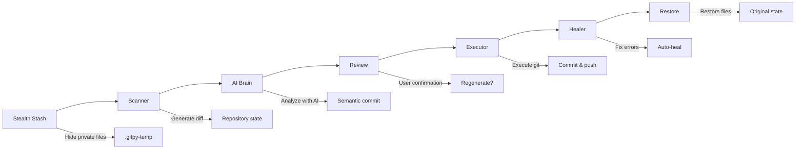
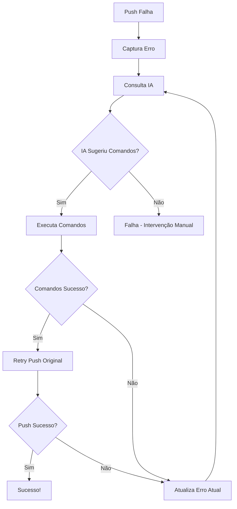

# ESPECIFICAÇÕES TÉCNICAS - COGIT CLI

> **Documento de Referência para Reconstrução em TypeScript/Node.js**
> 
> Versão: 1.0.0 | Baseado em: GitPy (Python)

---

## 1. VISÃO GERAL DO SISTEMA

### 1.1 Definição

**Cogit CLI** é uma ferramenta de linha de comando que transforma o workflow Git através de automação inteligente. Atua como um "DevOps Co-Pilot", analisando mudanças, gerando mensagens de commit semânticas, executando operações Git e corrigindo erros automaticamente.

### 1.2 Stack Tecnológica Alvo

| Camada | Tecnologia |
|--------|------------|
| Runtime | Node.js 18+ |
| Linguagem | TypeScript 5.x |
| CLI Framework | Commander.js ou Oclif |
| UI/Output | Chalk + Ora (spinners) + Inquirer.js |
| HTTP Client | Axios ou undici |
| Config | dotenv + cosmiconfig |

### 1.3 Princípios de Arquitetura

1. **Atomicidade:** Módulos ≤ 250 linhas
2. **Isolamento de Canais:** STDOUT para JSON, STDERR para logs
3. **Contrato como Verdade:** Interfaces são imutáveis, implementações são descartáveis
4. **Assincronia:** Nunca bloquear o Event Loop (usar `async/await`)

---

## 2. MATRIZ DE FUNCIONALIDADES

### 2.1 AI Core

| Feature | Descrição | Prioridade |
|---------|-----------|------------|
| **Semantic Commits** | Analisa diffs e gera Conventional Commits | Alta |
| **Message Regeneration** | Regeneração interativa até satisfação | Alta |
| **Multi-Provider Support** | Groq, OpenAI, Gemini, Ollama, OpenRouter | Alta |
| **Context Hints** | Guia IA com contexto específico (`-m`) | Média |
| **Auto-Fallback** | Fallback automático entre provedores | Alta |

### 2.2 Automation

| Feature | Descrição | Flag |
|---------|-----------|------|
| **Full Autonomous Mode** | Operação hands-free completa | `--yes` |
| **Interactive Menu** | Interface guiada para operações | `menu` |
| **Dry Run Simulation** | Preview sem executar | `--dry-run` |
| **Local Commits Only** | Commit sem push | `--no-push` |
| **Skip Deploy Mode** | Adiciona `[CI Skip]` ao commit | `--nobuild` |

### 2.3 Branch Management

| Feature | Descrição | Comando |
|---------|-----------|---------|
| **Test Branch Creation** | Criar/usar branches isoladas | `--branch <name>` |
| **Branch Navigation** | Alternar entre branches existentes | `--branch <existing>` |
| **Branch Center** | Operações completas de branch | `menu → Branch Center` |
| **Validation** | Padrões Git para nomes de branch | Automático |

### 2.4 Tag Management

| Feature | Descrição | Segurança |
|---------|-----------|-----------|
| **Create Tag** | Criar tags anotadas ou leves | - |
| **List Tags** | Listar tags locais e remotas | - |
| **Delete Tag** | Remover tags | **Código 4 caracteres** |
| **Reset Tag** | Resetar para tag específica | **Código 4 caracteres** |
| **Push Tag** | Enviar tags para remote | - |

### 2.5 Security (Lead Wall)

| Camada | Componente | Função |
|--------|------------|--------|
| 1 | **Sanitizer** | Bloqueia arquivos sensíveis (Blocklist) |
| 2 | **Redactor** | Mascara secrets em diffs |
| 3 | **Panic Lock** | Proteção inquebrável do `.env` |
| 4 | **Stealth Mode** | Oculta arquivos privados temporariamente |

### 2.6 Smart Features

| Feature | Descrição |
|---------|-----------|
| **Smart Ignore** | Sugestões proativas de `.gitignore` |
| **Smart Whitelist** | Exceções customizadas via comentários |
| **Modular Config** | Padrões editáveis em `common_trash.json` |
| **Vibe Vault** | Gerenciamento de diffs > 100KB |

### 2.7 Internationalization (i18n)

| Configuração | Opções | Descrição |
|--------------|--------|-----------|
| `LANGUAGE` | `en`, `pt` | Idioma da interface (menus, mensagens) |
| `COMMIT_LANGUAGE` | `en`, `pt` | Idioma das mensagens de commit |

**Características:**
- Configurações independentes (interface ≠ commits)
- Fallback automático para inglês
- Sistema de templates por idioma

### 2.8 Diagnostics

| Feature | Comando | Função |
|---------|---------|--------|
| **AI Health Check** | `check-ai` | Testa conectividade com provedores |
| **Deep Trace Mode** | `--debug` | Captura payloads em `.vibe-debug.log` |
| **Resource Viewer** | `menu → View Resources` | Mapa completo de recursos |

---

## 3. FLUXO DE AUTOMAÇÃO

### 3.1 Diagrama Mermaid



### 3.2 Sequência Detalhada

```
┌─────────────────────────────────────────────────────────────────┐
│ 1. STEALTH STASH                                                │
│    • Lê .gitpy-private                                          │
│    • Move arquivos privados para .gitpy-temp                    │
│    • Garante .gitpy-temp no .gitignore                          │
├─────────────────────────────────────────────────────────────────┤
│ 2. SCANNER                                                      │
│    • Verifica se é repositório Git                              │
│    • Detecta mudanças (staged/unstaged)                         │
│    • Gera diff completo                                          │
│    • Usa VibeVault se diff > 100KB                              │
├─────────────────────────────────────────────────────────────────┤
│ 3. SANITIZER (Lead Wall - Layer 1)                              │
│    • Valida arquivos contra Blocklist Imutável                  │
│    • Aborta se detectar violação                                │
├─────────────────────────────────────────────────────────────────┤
│ 4. REDACTOR (Lead Wall - Layer 2)                               │
│    • Mascara padrões de secrets no diff                         │
│    • Padrões: API keys, tokens, passwords                       │
├─────────────────────────────────────────────────────────────────┤
│ 5. AI BRAIN                                                     │
│    • Carrega template de prompt (baseado em COMMIT_LANGUAGE)    │
│    • Constrói prompt com diff + hint + style guide              │
│    • Invoca provedor de IA (com fallback automático)            │
│    • Normaliza resposta para formato Conventional Commits       │
├─────────────────────────────────────────────────────────────────┤
│ 6. REVIEW                                                       │
│    • Exibe mensagem gerada                                      │
│    • Opções: Execute / Regenerate / Cancel                      │
│    • Loop de regeneração até satisfação                         │
├─────────────────────────────────────────────────────────────────┤
│ 7. EXECUTOR                                                     │
│    • git add -A                                                 │
│    • git commit -m "<mensagem>"                                  │
│    • git push (se não --no-push)                                │
├─────────────────────────────────────────────────────────────────┤
│ 8. HEALER (se push falhar)                                      │
│    • Captura erro                                               │
│    • Consulta IA para estratégia de correção                    │
│    • Executa comandos sugeridos                                 │
│    • Retry até sucesso ou max_retries                           │
├─────────────────────────────────────────────────────────────────┤
│ 9. RESTORE                                                      │
│    • Devolve arquivos de .gitpy-temp                            │
│    • Remove .gitpy-temp                                         │
│    • Trata conflitos de restauração                             │
└─────────────────────────────────────────────────────────────────┘
```

---

## 4. COMANDOS E FLAGS

### 4.1 Comandos Principais

| Comando | Propósito | Exemplo |
|---------|-----------|---------|
| `auto` | Commit & push autônomo | `cogit auto --yes` |
| `menu` | Interface interativa guiada | `cogit menu` |
| `check-ai` | Testa conectividade IA | `cogit check-ai` |

### 4.2 Flags Globais

| Flag | Shortcut | Função | Exemplo |
|------|----------|--------|---------|
| `--debug` | - | Deep Trace Mode (captura payloads) | `cogit --debug auto` |
| `--path <dir>` | `-p` | Diretório alvo diferente | `cogit --path /repo auto` |

### 4.3 Flags do Comando `auto`

| Flag | Shortcut | Função | Exemplo |
|------|----------|--------|---------|
| `--yes` | `-y` | Confirmação automática | `cogit auto --yes` |
| `--dry-run` | - | Simulação (não executa) | `cogit auto --dry-run` |
| `--no-push` | - | Commit local apenas | `cogit auto --yes --no-push` |
| `--nobuild` | - | Adiciona `[CI Skip]` | `cogit auto --yes --nobuild` |
| `--branch <name>` | `-b` | Cria/usar branch específica | `cogit auto -b feature-test` |
| `--message "..."` | `-m` | Dica de contexto para IA | `cogit auto -m "fix login"` |
| `--model <provider>` | - | Escolhe provedor IA | `cogit auto --model openai` |

### 4.4 Exemplos Práticos

```bash
# Fluxo totalmente autônomo
cogit auto --yes

# Modo interativo com regeneração
cogit auto
# → Mostra mensagem
# → Escolha: Execute / Regenerate / Cancel

# Simulação
cogit auto --dry-run

# Branch de teste isolada
cogit auto --yes --branch feature-auth

# Commit WIP (local apenas)
cogit auto --yes --no-push

# Economizar quota CI/CD
cogit auto --yes --nobuild

# Debug de integração IA
cogit --debug auto --model groq

# Com contexto específico
cogit auto --yes -m "refactor authentication system"
```

---

## 5. SISTEMA DE SEGURANÇA (LEAD WALL)

### 5.1 Camada 1 - Sanitizer (Blocklist Imutável)

**Arquivo de Definição:** `services/security/blocklist.ts`

```typescript
const BLOCKED_PATTERNS: readonly string[] = [
  // Diretórios de Infraestrutura e Credenciais
  ".ssh/", ".aws/", ".azure/", ".kube/", ".gnupg/", ".docker/",
  
  // Arquivos de Chaves Privadas
  "id_rsa", "id_ed25519", "id_dsa", "id_ecdsa",
  "*.pem", "*.key", "*.p12", "*.pfx", "*.keystore", "*.jks",
  
  // Variáveis de Ambiente
  ".env", ".env.local", ".env.development", ".env.production", ".env.test",
  "secrets.yaml", "secrets.json",
  
  // Históricos de Shell
  ".bash_history", ".zsh_history", ".python_history", ".mysql_history", ".psql_history",
  
  // Padrões Genéricos de Alto Risco
  "**/token.txt", "**/password.txt", "**/credentials.json"
];
```

**Regras:**
- Case-insensitive
- Imutável em runtime (hardcoded)
- Nenhuma configuração de usuário pode sobrescrever

### 5.2 Camada 2 - Redactor (Data Masking)

**Padrões de Redação:**

```typescript
const REDACTION_PATTERNS = [
  // API Keys
  { pattern: /(?:api[_-]?key|apikey)\s*[=:]\s*['"]?([a-zA-Z0-9_-]{20,})['"]?/gi, replacement: '***API_KEY_REDACTED***' },
  
  // Tokens
  { pattern: /(?:token|auth[_-]?token)\s*[=:]\s*['"]?([a-zA-Z0-9_-]{20,})['"]?/gi, replacement: '***TOKEN_REDACTED***' },
  
  // Passwords
  { pattern: /(?:password|passwd|pwd)\s*[=:]\s*['"]?([^'"\s]+)['"]?/gi, replacement: '***PASSWORD_REDACTED***' },
  
  // AWS Keys
  { pattern: /AKIA[0-9A-Z]{16}/g, replacement: '***AWS_KEY_REDACTED***' },
  
  // Generic Secrets
  { pattern: /(?:secret|private[_-]?key)\s*[=:]\s*['"]?([a-zA-Z0-9_-]{20,})['"]?/gi, replacement: '***SECRET_REDACTED***' },
];
```

### 5.3 Camada 3 - Panic Lock (.Env Protection)

**Regra Inquebrável:**

```typescript
function validateGitignoreWhitelist(patterns: string[]): void {
  const envPatterns = ['.env', '.env.local', '.env.*'];
  
  for (const pattern of patterns) {
    if (envPatterns.some(env => pattern.includes(env))) {
      console.error('⚠️ SECURITY ALERT: The .env file has been marked as NOT to be ignored.');
      console.error('This could expose your passwords on GitHub!');
      console.error('ERROR: Operation cancelled for security.');
      process.exit(1);
    }
  }
}
```

### 5.4 Stealth Mode (.gitpy-private)

**Arquivo de Configuração:** `.gitpy-private`

```text
# Arquivos/diretórios a ocultar durante operações Git
.my_secret_folder/
local_logs.txt
agent_configs_x/*.json
**/private/**
```

**Mecanismo:**

```
┌─────────────────────────────────────────────────────────────┐
│ STASH (antes das operações)                                 │
│   1. Lê padrões de .gitpy-private                           │
│   2. Move arquivos matching para .gitpy-temp/               │
│   3. Garante .gitpy-temp/ no .gitignore                     │
│   4. Git "enxerga" apenas arquivos públicos                 │
├─────────────────────────────────────────────────────────────┤
│ RESTORE (após operações)                                    │
│   1. Move arquivos de .gitpy-temp/ de volta                 │
│   2. Trata conflitos (renomeia para .restored)              │
│   3. Remove .gitpy-temp/                                    │
└─────────────────────────────────────────────────────────────┘
```

---

## 6. GERENCIAMENTO DE ERROS (GIT HEALER)

### 6.1 Fluxo de Cura



### 6.2 Interface do Healer

```typescript
interface HealerInput {
  repoPath: string;
  failedCommand: string;
  errorOutput: string;
  provider: string;
  maxRetries: number;
}

interface HealerOutput {
  success: boolean;
  message: string;
  attempts: number;
}

// System Prompt para IA
const HEALER_SYSTEM_PROMPT = `
Você é um Especialista em Git e Resolução de Conflitos.
Seu objetivo é analisar um erro de execução do Git e fornecer APENAS a sequência de comandos para corrigi-lo.

Regras:
- Responda APENAS com os comandos, um por linha.
- Não use blocos de código (\\\`\\\`\\\`), não use explicações.
- Se o erro for de 'non-fast-forward', sugira 'git pull --rebase'.
- IMPORTANTE: Se um comando da sua lista falhar, a execução PARA e eu volto para você com o erro.
- Se o erro atual for um CONFLITO, NÃO SUGIRA 'git rebase --abort' a menos que queira desistir.
- Para resolver conflitos: Sugira apenas 'git add .' e 'git rebase --continue'.
`;
```

### 6.3 Histórico de Tentativas

```typescript
interface HealerAttempt {
  attempt: number;
  commands: string[];
  success: boolean;
  error: string;
}

// Mantém histórico entre tentativas para contexto da IA
const history: HealerAttempt[] = [];
```

---

## 7. INTERNACIONALIZAÇÃO (i18n)

### 7.1 Estrutura de Arquivos

```
locales/
├── en.json     # Interface em inglês
├── pt.json     # Interface em português
└── es.json     # Interface em espanhol (extensível)

services/ai/prompts/
├── en.json     # Templates de commit em inglês
├── pt.json     # Templates de commit em português
└── es.json     # Templates de commit em espanhol
```

### 7.2 Configuração de Idiomas

```typescript
// env_config.ts
export const LANGUAGE = process.env.LANGUAGE?.toLowerCase() || 'en';
export const COMMIT_LANGUAGE = process.env.COMMIT_LANGUAGE?.toLowerCase() || 'en';

// Validação
const VALID_LANGUAGES = ['en', 'pt'];
const validateLanguage = (lang: string): string => 
  VALID_LANGUAGES.includes(lang) ? lang : 'en';
```

### 7.3 Sistema de Templates de Commit

```json
// services/ai/prompts/en.json
{
  "system_prompt": "You are a Senior DevOps Assistant. Generate Git commit messages following these style guidelines:\n\n{style_guide}",
  "user_prompt_template": "Generate a commit message for the following changes:\n\n{diff}\n{truncated_hint}",
  "hint_template": "\nHint: '{hint}'",
  "truncated_hint": "\nNote: The diff was truncated due to size. Focus on the beginning and end.",
  "fallback_title": "update: general changes",
  "fallback_detail": "details unavailable",
  "truncation_warning": "The diff content was truncated. Work with available context.",
  "no_context_error": "No diff or hint to work with."
}
```

```json
// services/ai/prompts/pt.json
{
  "system_prompt": "Você é um Assistente DevOps Sênior. Gere mensagens de commit Git seguindo estas diretrizes de estilo:\n\n{style_guide}",
  "user_prompt_template": "Gere uma mensagem de commit para as seguintes mudanças:\n\n{diff}\n{truncated_hint}",
  "hint_template": "\nDica: '{hint}'",
  "truncated_hint": "\nNota: O diff foi truncado devido ao tamanho. Foque no início e fim.",
  "fallback_title": "atualização: mudanças gerais",
  "fallback_detail": "detalhes indisponíveis",
  "truncation_warning": "O conteúdo do diff foi truncado. Trabalhe com o contexto disponível.",
  "no_context_error": "Sem diff ou dica para trabalhar."
}
```

### 7.4 Fallback Automático

```typescript
class I18nManager {
  private translations: Map<string, Record<string, string>> = new Map();
  private defaultLang = 'en';
  private currentLang: string;

  t(key: string, vars?: Record<string, string>): string {
    // Tenta idioma atual
    let text = this.translations.get(this.currentLang)?.[key];
    
    // Fallback para inglês
    if (!text) {
      text = this.translations.get(this.defaultLang)?.[key] || key;
    }
    
    // Interpolação de variáveis
    if (vars) {
      Object.entries(vars).forEach(([k, v]) => {
        text = text.replace(new RegExp(`\\{${k}\\}`, 'g'), v);
      });
    }
    
    return text;
  }
}
```

---

## 8. VIBE VAULT & GRANDES DIFFS

### 8.1 Regra dos 100KB

```typescript
const SIZE_THRESHOLD_KB = 100;
const SIZE_THRESHOLD_BYTES = SIZE_THRESHOLD_KB * 1024;

function smartPack(data: string): { mode: 'direct' | 'ref'; payload?: string; dataRef?: string } {
  const sizeInBytes = Buffer.byteLength(data, 'utf-8');
  
  if (sizeInBytes <= SIZE_THRESHOLD_BYTES) {
    return { mode: 'direct', payload: data };
  }
  
  // Armazena em memória e retorna referência
  const refId = VibeVault.store(data);
  return { mode: 'ref', dataRef: refId };
}
```

### 8.2 VibeVault (Memory Store)

```typescript
class VibeVault {
  private static storage: Map<string, string> = new Map();

  static store(data: string): string {
    const refId = `ref-${randomUUID().split('-')[0]}`;
    this.storage.set(refId, data);
    return refId;
  }

  static retrieve(refId: string): string | undefined {
    return this.storage.get(refId);
  }

  static cleanup(refId: string): void {
    this.storage.delete(refId);
  }

  static async withAutoCleanup<T>(refId: string, fn: () => Promise<T>): Promise<T> {
    try {
      return await fn();
    } finally {
      this.cleanup(refId);
    }
  }
}
```

### 8.3 Uso no Scanner

```typescript
async function scanRepository(repoPath: string): Promise<ScanResult> {
  const diff = await executeGit(repoPath, 'diff HEAD');
  
  const diffData = smartPack(diff);
  
  return {
    isRepo: true,
    hasChanges: diff.length > 0,
    diffData: diffData.mode === 'ref' 
      ? { mode: 'ref', dataRef: diffData.dataRef, preview: diff.slice(0, 2000) }
      : { mode: 'direct', content: diffData.payload },
  };
}
```

---

## 9. ARQUITETURA TYPESCRIPT

### 9.1 Tradução de Caruchos para Services

```
Python (Cartridges)          →    TypeScript (Services)
─────────────────────────────────────────────────────────
cartridges/                       src/
├── ai/                           ├── services/
│   ├── ai-brain/                 │   ├── ai/
│   │   ├── manifest.json    →    │   │   ├── brain/
│   │   ├── main.py         →    │   │   │   ├── index.ts
│   │   └── dlc.py          →    │   │   │   └── utils.ts
│   ├── ai-groq/                  │   │   └── providers/
│   ├── ai-openai/                │   │       ├── groq.ts
│   └── ...                       │   │       ├── openai.ts
├── core/                         │   │       └── ...
│   ├── git-scanner/              │   └── git/
│   ├── git-executor/             │       ├── scanner.ts
│   ├── git-healer/               │       ├── executor.ts
│   └── ...                       │       ├── healer.ts
├── security/                     │       └── ...
│   ├── sec-sanitizer/            └── security/
│   ├── sec-redactor/                 ├── sanitizer.ts
│   └── ...                           ├── redactor.ts
└── tool/                             └── keyring.ts
    ├── tool-stealth/             
    └── tool-ignore/              └── tools/
                                      ├── stealth.ts
                                      └── ignore.ts
```

### 9.2 Kernel → ServiceContainer

```typescript
// src/core/container.ts
interface ServiceManifest {
  identity: {
    name: string;
    version: string;
    description: string;
  };
  ioContract: {
    inputSchema: JSONSchema;
    outputSchema: JSONSchema;
  };
  errorDictionary: Record<string, string>;
}

class ServiceContainer {
  private services: Map<string, ServiceHandler> = new Map();
  private cache: Map<string, ServiceHandler> = new Map();
  private debugMode: boolean = false;

  async run(servicePath: string, payload: Record<string, unknown>): Promise<ServiceResult> {
    const cid = this.generateCid();
    payload.cid = cid;

    if (!this.cache.has(servicePath)) {
      this.cache.set(servicePath, await this.loadService(servicePath));
    }

    const handler = this.cache.get(servicePath)!;
    
    this.log(servicePath, cid, 'Starting execution...');
    
    try {
      const result = await handler(payload);
      result.cid = cid;
      return result;
    } catch (error) {
      return {
        status: 'error',
        code: 'INTERNAL_FAILURE',
        message: String(error),
        cid,
      };
    }
  }

  private generateCid(): string {
    return `cogit-${randomUUID().split('-')[0]}`;
  }

  log(service: string, cid: string, message: string, level: 'INFO' | 'ERROR' | 'WARN' = 'INFO'): void {
    const timestamp = new Date().toISOString();
    process.stderr.write(`[${timestamp}][${level}][${cid}][${service}] ${message}\n`);
  }
}
```

### 9.3 Interface de Serviço

```typescript
// src/types/service.ts
interface ServiceHandler {
  (payload: ServicePayload): Promise<ServiceResult>;
}

interface ServicePayload {
  cid?: string;
  [key: string]: unknown;
}

interface ServiceResult {
  status: 'success' | 'error';
  code?: string;
  message?: string;
  cid: string;
  [key: string]: unknown;
}
```

### 9.4 Estrutura de Diretórios Completa

```
cogit-cli/
├── src/
│   ├── index.ts                    # Entry point
│   ├── cli/
│   │   ├── index.ts                # CLI definition (Commander)
│   │   ├── commands/
│   │   │   ├── auto.ts             # auto command
│   │   │   ├── menu.ts             # menu command
│   │   │   └── check-ai.ts         # check-ai command
│   │   └── ui/
│   │       ├── renderer.ts         # Output formatting
│   │       └── prompts.ts          # Interactive prompts
│   ├── core/
│   │   ├── container.ts            # Service container (Kernel)
│   │   └── vault.ts                # VibeVault (Memory store)
│   ├── services/
│   │   ├── ai/
│   │   │   ├── brain/
│   │   │   │   ├── index.ts        # Main logic
│   │   │   │   ├── prompts.ts      # Prompt templates
│   │   │   │   └── normalizer.ts   # Message normalization
│   │   │   └── providers/
│   │   │       ├── base.ts         # Base provider interface
│   │   │       ├── groq.ts
│   │   │       ├── openai.ts
│   │   │       ├── gemini.ts
│   │   │       ├── ollama.ts
│   │   │       └── openrouter.ts
│   │   ├── git/
│   │   │   ├── scanner.ts
│   │   │   ├── executor.ts
│   │   │   ├── healer.ts
│   │   │   ├── branch.ts
│   │   │   └── tag.ts
│   │   ├── security/
│   │   │   ├── sanitizer.ts        # Blocklist checker
│   │   │   ├── redactor.ts         # Data masking
│   │   │   └── keyring.ts          # Credential storage
│   │   └── tools/
│   │       ├── stealth.ts          # Private file hiding
│   │       └── ignore.ts           # .gitignore management
│   ├── config/
│   │   ├── env.ts                  # Environment config
│   │   └── i18n.ts                 # Internationalization
│   ├── locales/
│   │   ├── en.json
│   │   └── pt.json
│   └── types/
│       ├── service.ts
│       ├── git.ts
│       └── ai.ts
├── package.json
├── tsconfig.json
├── .env.example
└── README.md
```

---

## 10. CONFIRMAÇÃO DE SEGURANÇA (4 CARACTERES)

### 10.1 Geração de Código

```typescript
function generateConfirmationCode(): string {
  const letters = 'ABCDEFGHJKLMNPQRSTUVWXYZ'; // Sem I, O (confusão)
  const numbers = '23456789'; // Sem 0, 1 (confusão)
  
  const pattern = [
    letters[Math.floor(Math.random() * letters.length)],
    numbers[Math.floor(Math.random() * numbers.length)],
    letters[Math.floor(Math.random() * letters.length)],
    letters[Math.floor(Math.random() * letters.length)],
  ];
  
  return pattern.join(''); // Ex: B2CR
}
```

### 10.2 Validação

```typescript
function validateConfirmationCode(input: string, expected: string): boolean {
  return input.toUpperCase().trim() === expected.toUpperCase();
}
```

### 10.3 Operações Protegidas

| Operação | Requer Código |
|----------|---------------|
| Delete tag (local) | Sim |
| Delete tag (remote) | Sim |
| Reset to tag | Sim |
| Delete branch | Sim |
| Force push | Sim |

### 10.4 Fluxo de Confirmação

```typescript
async function confirmDestructiveOperation(operation: string): Promise<boolean> {
  const code = generateConfirmationCode();
  
  console.log(`⚠️  DESTRUCTIVE OPERATION: ${operation}`);
  console.log(`   Type this code to confirm: ${code}`);
  
  const input = await prompt('Confirmation code: ');
  
  if (!validateConfirmationCode(input, code)) {
    console.log('❌ Invalid confirmation code. Operation cancelled.');
    return false;
  }
  
  return true;
}
```

---

## 11. CONFIGURAÇÃO DE AMBIENTE

### 11.1 Variáveis de Ambiente

```env
# .env.example

# === AI PROVIDER ===
# Options: auto, openrouter, groq, openai, gemini, ollama
AI_PROVIDER=auto

# === LANGUAGE SETTINGS (Independent) ===
LANGUAGE=en                    # Interface language (en, pt)
COMMIT_LANGUAGE=en            # Commit message language (en, pt)

# === API KEYS (choose at least one) ===
OPENROUTER_API_KEY=your_openrouter_key
GROQ_API_KEY=your_groq_key
OPENAI_API_KEY=your_openai_key
GEMINI_API_KEY=your_gemini_key
# OLLAMA doesn't require API key (local)

# === MODEL CONFIGURATION (optional) ===
OPENROUTER_MODEL=meta-llama/llama-4-scout
GROQ_MODEL=meta-llama/llama-4-scout-17b-16e-instruct
OPENAI_MODEL=gpt-4o-mini
GEMINI_MODEL=gemini-pro
```

### 11.2 Configuração de Modelos

```typescript
// src/config/env.ts
export const AI_MODELS: Record<string, string> = {
  openrouter: process.env.OPENROUTER_MODEL || 'meta-llama/llama-4-scout',
  groq: process.env.GROQ_MODEL || 'meta-llama/llama-4-scout-17b-16e-instruct',
  openai: process.env.OPENAI_MODEL || 'gpt-4o-mini',
  gemini: process.env.GEMINI_MODEL || 'gemini-pro',
  ollama: process.env.OLLAMA_MODEL || 'llama3',
};

export const API_KEYS: Record<string, string> = {
  openrouter: process.env.OPENROUTER_API_KEY || '',
  groq: process.env.GROQ_API_KEY || '',
  openai: process.env.OPENAI_API_KEY || '',
  gemini: process.env.GEMINI_API_KEY || '',
  ollama: '', // Local, no key needed
};
```

---

## 12. PADRÕES DE COMMIT

### 12.1 Formato de Saída

```
<type>(<scope>): <subject>

<body>

<footer>
```

### 12.2 Categorias com Marcadores

| Marcador | Categorias |
|----------|------------|
| `x` | feat, feature, enhancement, improvement, melhoria |
| `b` | fix, bugfix, bug, hotfix, correcao, correção |
| `t` | update, chore, refactor, atualizacao, atualização |

### 12.3 Normalização

```typescript
function normalizeCommitMessage(rawText: string, lang: string): string {
  // Remove markdown code blocks
  let clean = rawText.replace(/```/g, '').replace(/commit:/g, '').trim();
  
  const lines = clean.split('\n').filter(l => l.trim());
  
  // Title: max 50 chars
  const title = lines[0].slice(0, 50).trim();
  
  // Body: normalize bullets with category markers
  const bodyLines = lines.slice(1).map(line => {
    const match = line.match(/^(feat|fix|update|...)\s*[:\-]?\s*(.+)$/i);
    if (match) {
      const marker = CATEGORY_MAP[match[1].toLowerCase()] || 't';
      return `- ${marker} ${match[2].trim()}`;
    }
    return `- t ${line.replace(/^[-*•]\s*/, '').trim()}`;
  });
  
  return `${title}\n\n${bodyLines.join('\n')}`;
}
```

---

## 13. DEPENDÊNCIAS NODE.JS

### 13.1 Produção

```json
{
  "dependencies": {
    "commander": "^12.0.0",
    "inquirer": "^9.2.0",
    "chalk": "^5.3.0",
    "ora": "^8.0.0",
    "dotenv": "^16.4.0",
    "axios": "^1.6.0",
    "openai": "^4.28.0",
    "@google/generative-ai": "^0.21.0",
    "groq-sdk": "^0.5.0",
    "uuid": "^9.0.0"
  }
}
```

### 13.2 Desenvolvimento

```json
{
  "devDependencies": {
    "typescript": "^5.4.0",
    "@types/node": "^20.11.0",
    "@types/inquirer": "^9.0.0",
    "ts-node": "^10.9.0",
    "vitest": "^1.3.0",
    "eslint": "^8.56.0"
  }
}
```

---

## 14. CHECKLIST DE IMPLEMENTAÇÃO

### Fase 1: Core Infrastructure
- [ ] Setup projeto TypeScript
- [ ] Implementar ServiceContainer (Kernel)
- [ ] Implementar VibeVault (Memory Store)
- [ ] Sistema de configuração (env)
- [ ] Sistema de logs (STDERR)

### Fase 2: Git Services
- [ ] git-scanner
- [ ] git-executor
- [ ] git-branch
- [ ] git-tag
- [ ] git-healer

### Fase 3: Security Services
- [ ] sec-sanitizer (Blocklist)
- [ ] sec-redactor (Data Masking)
- [ ] sec-keyring (Credential Storage)
- [ ] Panic Lock validation

### Fase 4: AI Services
- [ ] AI Provider base interface
- [ ] ai-openai provider
- [ ] ai-groq provider
- [ ] ai-gemini provider
- [ ] ai-ollama provider
- [ ] ai-openrouter provider
- [ ] ai-brain (orchestrator)
- [ ] Prompt templates (en, pt)

### Fase 5: Tool Services
- [ ] tool-stealth (Private files)
- [ ] tool-ignore (.gitignore management)

### Fase 6: CLI
- [ ] Commander setup
- [ ] auto command
- [ ] menu command
- [ ] check-ai command
- [ ] UI components (Chalk, Ora, Inquirer)
- [ ] i18n integration

### Fase 7: Testing & Polish
- [ ] Unit tests
- [ ] Integration tests
- [ ] Documentation
- [ ] README.md

---

**Documento gerado a partir da análise do repositório GitPy (Python)**
**Versão do documento: 1.0.0**
