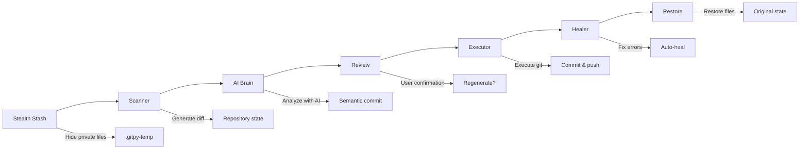

# GitPy: The DevOps Co-Pilot for Your Repositories ☁️🤖

> **"It doesn't just version. It Understands, Protects, Automates, and Heals."**

**GitPy** is a next-generation CLI that transforms your Git workflow. Built on the **Vibe Architecture** (a modular pluggable cartridge system) and powered by AI (currently via **Groq**, **OpenAI**, **Gemini**, **Ollama**, **OpenRouter**), it acts as a senior DevOps engineer pairing with you in real-time.

---

## 🚀 Quick Start

### Zero Configuration Required

```bash
# Install dependencies
pip install -r requirements.txt

# Configure your AI provider (copy .env.example to .env)
cp .env.example .env
# Edit .env with your API keys

# Run autonomous mode
python launcher.py auto --yes
```

> **One Command Everything**: GitPy automatically scans, analyzes, commits, and pushes your changes with semantic commit messages.

---

## 🏗️ Architecture Overview

### The Vibe Architecture

GitPy uses a modular cartridge system where each functionality is an isolated component:

```
GitPy Core (vibe_core.py)
├── 🧠 AI Cartridges
│   ├── ai-brain      → Commit message generation
│   ├── ai-groq       → Groq API integration
│   ├── ai-openai     → OpenAI GPT integration
│   ├── ai-gemini     → Google Gemini integration
│   ├── ai-ollama     → Local Ollama integration
│   └── ai-openrouter → OpenRouter API integration
├── ⚙️ Core Cartridges
│   ├── git-scanner   → Repository analysis
│   ├── git-executor  → Git operations
│   ├── git-healer    → Auto-conflict resolution
│   ├── git-branch    → Branch management
│   └── git-tag       → Tag operations
├── �️ Security Cartridges
│   ├── sec-sanitizer → Block sensitive files
│   ├── sec-redactor  → Mask sensitive data
│   └── sec-keyring   → Secure credential storage
└── 🔧 Tool Cartridges
    ├── tool-stealth   → Hide private files temporarily
    └── tool-ignore    → Smart .gitignore management
```

### Automation Flow



---

## 🌟 Feature Matrix

| Category | Feature | Description | Command |
| :--- | :--- | :--- | :--- |
| **🧠 AI Core** | **Semantic Commits** | Analyzes diffs and writes Conventional Commits | `auto` |
| | **Message Regeneration** | Interactive regeneration until satisfied | `auto` (interactive) |
| | **Multi-Provider Support** | Groq, OpenAI, Gemini, Ollama, OpenRouter | `--model <provider>` |
| | **Context Hints** | Guide AI with specific context | `-m "context"` |
| **� Automation** | **Full Autonomous Mode** | Complete hands-free operation | `auto --yes` |
| | **Interactive Menu** | Guided menu for all operations | `menu` |
| | **Dry Run Simulation** | Preview actions without executing | `--dry-run` |
| | **Local Commits Only** | Commit without pushing | `--no-push` |
| | **Skip Deploy Mode** | Add [CI Skip] to avoid builds | `--nobuild` |
| **🌿 Branch Management** | **Test Branch Creation** | Create/use isolated branches | `--branch <name>` |
| | **Branch Navigation** | Switch between existing branches | `--branch <existing>` |
| | **Branch Center** | Complete branch operations | `menu → Branch Center` |
| **🏷️ Tag Management** | **Tag Operations** | Create, list, delete, reset tags | `menu → Tag Center` |
| | **Strong Confirmation** | 4-character code for destructive ops | Interactive |
| **🛡️ Security** | **Stealth Mode** | Temporarily hide private files | `.gitpy-private` |
| | **Lead Wall** | 3-layer security system | Automatic |
| | **Blocklist Protection** | Prevent sensitive file commits | Automatic |
| | **Data Redaction** | Mask passwords in diffs | Automatic |
| | **Panic Lock .Env** | Unbreakable .env protection | Automatic |
| **� Smart Features** | **Smart Ignore** | Proactive .gitignore suggestions | Automatic |
| | **Smart Whitelist** | Custom exceptions in .gitignore | Comments in .gitignore |
| | **Modular Configuration** | Editable ignore patterns | `common_trash.json` |
| | **Vibe Vault** | Handle large diffs (>100KB) | Automatic |
| **🌍 Internationalization** | **Multi-Language Interface** | English/Portuguese CLI | `LANGUAGE=pt` |
| | **Multi-Language Commits** | English/Portuguese messages | `COMMIT_LANGUAGE=pt` |
| | **Independent Settings** | Different languages for interface/commits | `.env` config |
| **🛠️ Diagnostics** | **AI Health Check** | Test API keys and connectivity | `check-ai` |
| | **Deep Trace Mode** | Capture AI payloads for debugging | `--debug` |
| | **Resource Viewer** | Complete GitPy resource map | `menu → View Resources` |
| **🔧 Advanced** | **Git Healer** | Auto-fix push conflicts | Automatic |
| | **Repository Reset** | Guided repository reset operations | `menu → Reset Repository` |
| | **Command Wrappers** | Global system integration | `gitpy.cmd`, `pygit.cmd` |

---

## 🎮 Usage Guide

### Primary Commands

| Command | Purpose | Example |
| :--- | :--- | :--- |
| **`auto`** | Autonomous commit & push | `python launcher.py auto --yes` |
| **`menu`** | Interactive guided interface | `python launcher.py menu` |
| **`check-ai`** | Test AI provider connectivity | `python launcher.py check-ai` |

### Command Options

| Flag | Shortcut | Function | Example |
| :--- | :--- | :--- | :--- |
| `--yes` | `-y` | **Automatic Confirmation** - Accept everything without asking | `auto --yes` |
| `--dry-run` | | **Simulation** - Preview actions without executing | `auto --dry-run` |
| `--no-push` | | **Local Commit Only** - Commit without pushing | `auto --yes --no-push` |
| `--nobuild` | | **Skip Deploy** - Add [CI Skip] to avoid CI/CD builds | `auto --yes --nobuild` |
| `--branch <name>` | `-b` | **Test Branch** - Create/use specific branch | `auto --yes --branch feature-test` |
| `--message "..."` | `-m` | **Context Hint** - Guide AI with specific context | `auto -m "fix login bug"` |
| `--model <name>` | | **Choose Provider** - Select AI provider manually | `auto --model openai` |
| `--debug` | | **Deep Trace** - Enable advanced diagnostics | `--debug auto` |
| `--path <dir>` | `-p` | **Target Directory** - Run in different repository | `--path /path/to/repo auto` |

### Practical Examples

#### Basic Workflows
```bash
# Full autonomous flow
python launcher.py auto --yes

# Interactive mode with regeneration
python launcher.py auto
# → Shows commit message
# → Choose: Execute / Regenerate / Cancel

# Simulation to see what would happen
python launcher.py auto --dry-run
```

#### Branch Management
```bash
# Create and work on test branch
python launcher.py auto --yes --branch feature-auth

# Switch to existing branch
python launcher.py auto --yes --branch develop

# Isolated testing without deploy
python launcher.py auto --yes --branch experiment --nobuild --no-push
```

#### Production Scenarios
```bash
# Work-in-progress commits (local only)
python launcher.py auto --yes --no-push

# Save build quota on CI/CD
python launcher.py auto --yes --nobuild

# Debug AI integration issues
python launcher.py --debug auto --model groq

# Commit with specific context
python launcher.py auto --yes -m "refactor authentication system"
```

---

## 🔧 Configuration

### Environment Setup

1. **Copy the template**:
```bash
cp .env.example .env
```

2. **Configure your providers**:
```env
# AI Provider (auto, openrouter, groq, openai, gemini, ollama)
AI_PROVIDER=auto

# Language Settings (Independent)
LANGUAGE=en                    # Interface language (en, pt)
COMMIT_LANGUAGE=en           # Commit message language (en, pt)

# API Keys (choose at least one)
GROQ_API_KEY=your_groq_key_here
OPENROUTER_API_KEY=your_openrouter_key_here
OPENAI_API_KEY=your_openai_key_here
GEMINI_API_KEY=your_gemini_key_here
```

### Language Configuration

| Setting | Options | Default | Description |
| :--- | :--- | :--- | :--- |
| `LANGUAGE` | `en`, `pt` | `en` | Interface language (menus, messages) |
| `COMMIT_LANGUAGE` | `en`, `pt` | `en` | AI-generated commit message language |

**Bilingual Example**:
```env
# Portuguese interface, English commits
LANGUAGE=pt
COMMIT_LANGUAGE=en
```

### AI Provider Configuration

| Provider | Model Config | Key Required | Get Key |
| :--- | :--- | :--- | :--- |
| **Groq** | `GROQ_MODEL=meta-llama/llama-4-scout-17b-16e-instruct` | `GROQ_API_KEY` | [console.groq.com](https://console.groq.com/keys) |
| **OpenAI** | `OPENAI_MODEL=gpt-4o-mini` | `OPENAI_API_KEY` | [platform.openai.com](https://platform.openai.com/api-keys) |
| **Gemini** | `GEMINI_MODEL=gemini-pro` | `GEMINI_API_KEY` | [aistudio.google.com](https://aistudio.google.com/app/apikey) |
| **OpenRouter** | `OPENROUTER_MODEL=meta-llama/llama-4-scout` | `OPENROUTER_API_KEY` | [openrouter.ai](https://openrouter.ai/keys) |
| **Ollama** | Local models | None | [ollama.ai](https://ollama.ai) |

---

## 🛡️ Security Features

### Multi-Layer Protection

1. **Blocklist System** - Prevents reading sensitive files
2. **Data Redaction** - Masks passwords and tokens in diffs
3. **Stealth Mode** - Temporarily hides private files
4. **Panic Lock** - Unbreakable .env protection

### Stealth Mode (.gitpy-private)

Hide sensitive files without cluttering your public `.gitignore`:

```text
# .gitpy-private
.my_secret_folder/
local_logs.txt
agent_configs_x/*.json
```

**How it works**:
1. GitPy moves files to temporary `.gitpy-temp` folder
2. Git runs "blind" without seeing these files
3. Files are restored after operations complete
4. Automatic recovery if interrupted

### Smart Whitelist (.gitignore)

Control what gets suggested as "trash" using special comments:

```gitignore
# ["build", "node_modules"] do not ignore
*.log
*.pyc
.DS_Store

# ["coverage"] do not ignore
.env
```

### .Env Security Lock

**⚠️ UNBREAKABLE PROTECTION**: Attempting to whitelist `.env` triggers immediate shutdown:

```
⚠️ SECURITY ALERT: The .env file has been marked as NOT to be ignored.
This could expose your passwords on GitHub!
ERROR: Operation cancelled for security.
```

---

## 🌿 Advanced Features

### Message Regeneration

Interactive regeneration until you're satisfied:

```bash
python launcher.py auto
# → AI generates commit message
# → Choose: Execute / Regenerate / Cancel
# → If "Regenerate": AI creates new message
# → Repeat until satisfied
```

### Branch Management

**Complete branch operations**:

```bash
# Interactive branch center
python launcher.py menu
# → "Branch Center"
# → Current branch, list branches, create, switch
```

**Command-line branch operations**:
```bash
# Create new test branch
python launcher.py auto --yes --branch feature-login

# Switch to existing branch
python launcher.py auto --yes --branch develop

# Branch validation (Git standards)
# - Must start with letter/number
# - Max 255 characters
# - No reserved names (HEAD, master, main)
```

### Tag Management

**Interactive Tag Center**:
```bash
python launcher.py menu
# → "Tag Center"
# → List/Create/Delete/Reset tags
```

**Strong Confirmation System**:
- Destructive operations require 4-character code
- Format: `LETTER-NUMBER-LETTER-LETTER` (ex: `B2CR`)
- Case-insensitive validation
- Prevents accidental deletions

### Git Healer

**Automatic conflict resolution**:
- Detects push failures (conflicts, rejects)
- Asks AI for specific fix instructions
- Applies corrections automatically
- Retries push until success

---

## 🌍 Internationalization

### Multi-Language Support

**Interface Languages**:
- English (`en`) - Default
- Portuguese (`pt`) - Complete translation

**Commit Languages**:
- English (`en`) - Default
- Portuguese (`pt`) - Full support

### Independent Configuration

Interface and commits can use different languages:

```env
# Portuguese interface, English commits
LANGUAGE=pt
COMMIT_LANGUAGE=en

# English interface, Portuguese commits  
LANGUAGE=en
COMMIT_LANGUAGE=pt
```

### Safe Fallback

- Missing translations automatically fall back to English
- Commit templates fallback to English if not found
- No breaking changes when adding new languages

### Adding New Languages

To add support for a new language (e.g., Spanish):
1. Create `locales/es.json` for interface translations
2. Create `cartridges/ai/ai-brain/prompts/es.json` for commit templates
3. Set `LANGUAGE=es` and/or `COMMIT_LANGUAGE=es` in `.env`

---

## 🛠️ Diagnostics & Debugging

### AI Health Check

Test your AI configuration:

```bash
python launcher.py check-ai
```

**Checks performed**:
- API key validation
- Provider connectivity
- Model availability
- Response format validation

### Deep Trace Mode

Enable advanced debugging:

```bash
python launcher.py --debug auto
```

**Captures in `.vibe-debug.log`**:
- Exact payloads sent to AI
- Raw AI responses including errors
- Technical error codes
- Complete request/response cycle

**Use cases**:
- Debug quota exceeded errors
- Identify model availability issues
- Audit data sent to LLMs
- Monitor integration during development

### Resource Viewer

```bash
python launcher.py menu
# → "View Resources"
```

Shows complete GitPy resource map:
- CLI flows and commands
- Available wrappers
- Global options
- i18n status

---

## 📦 Vibe Vault System

### Handling Large Diffs

**Automatic large payload management**:
- Diffs > 100KB automatically stored in memory
- Reference IDs passed instead of raw data
- Prevents JSON serialization issues
- Maintains performance with large changes

### Memory Management

```python
# Behind the scenes (automatic)
ref_id = VibeVault.store(large_diff)
# Pass ref_id to AI cartridges
result = VibeVault.retrieve(ref_id)
VibeVault.cleanup(ref_id)
```

---

## 🧰 Command Line Wrappers

### Windows Integration

**gitpy.cmd**:
```batch
@echo off
python "%~dp0launcher.py" %*
```
- Run GitPy from any directory
- Automatic path resolution
- No manual directory changes needed

**pygit.cmd**:
```batch
@echo off
C:\code\GitHub\gitpy\.venv\Scripts\activate.bat
```
- Activate project virtual environment
- Consistent dependencies across team
- Fixed virtual environment path

### Adding to Windows PATH

1. Search "Edit system environment variables"
2. Under "System variables", select `Path` → "Edit"
3. Add GitPy root directory
4. Restart terminal

### Linux/macOS Port

**gitpy.sh**:
```bash
#!/usr/bin/env bash
SCRIPT_DIR="$(cd "$(dirname "${BASH_SOURCE[0]}")" && pwd)"
python "$SCRIPT_DIR/launcher.py" "$@"
```

**pygit.sh**:
```bash
#!/usr/bin/env bash
SCRIPT_DIR="$(cd "$(dirname "${BASH_SOURCE[0]}")" && pwd)"
source "$SCRIPT_DIR/.venv/bin/activate"
```

---

## 🔧 Modular Configuration

### Common Trash Patterns

Edit `cartridges/tool/tool-ignore/common_trash.json`:

```json
[
    ".env",
    "__pycache__/",
    "*.pyc",
    "*.log",
    ".DS_Store",
    "node_modules/",
    "build/",
    ".vscode/",
    ".idea/",
    "coverage/",
    "*.swp",
    ".gitpy-private"
]
```

### Dynamic Loading

- Patterns loaded dynamically at runtime
- Safe fallback if JSON corrupted
- Default always includes: `[".env", "node_modules/", "build/"]`
- No code changes required for customization

---

## 📋 Use Cases & Workflows

### Development Workflow

```bash
# Morning setup - check AI status
python launcher.py check-ai

# Work on feature branch
python launcher.py auto --yes --branch feature-new-ui

# Multiple commits during development
python launcher.py auto --yes --no-push

# Final push with deploy
python launcher.py auto --yes
```

### Team Collaboration

```bash
# Portuguese interface, English commits (international team)
LANGUAGE=pt
COMMIT_LANGUAGE=en

# Work on shared branch
python launcher.py auto --yes --branch team-feature

# Skip deploy during active development
python launcher.py auto --yes --nobuild
```

### Production Deployment

```bash
# Critical bug fix - skip CI/CD
python launcher.py auto --yes -m "fix: critical security vulnerability" --nobuild

# Manual deployment after review
python launcher.py auto --yes
```

### Troubleshooting

```bash
# Debug connection issues
python launcher.py --debug auto

# Check .vibe-debug.log for details
cat .vibe-debug.log

# Verify AI providers
python launcher.py check-ai
```

---

## 🏗️ Technical Architecture

### Cartridge System

Each cartridge contains:
- `manifest.json` - Interface contract
- `main.py` - Business logic (max 250 lines)
- `dlc.py` - Infrastructure sidecar
- `requirements.txt` - Specific dependencies

### Kernel Architecture

**VibeKernel** (`vibe_core.py`):
- Hybrid async/sync execution
- Dynamic cartridge loading
- Memory management (VibeVault)
- Correlation ID tracking
- Deep trace logging

### Engineering Principles

1. **Atomicity** - Cartridge main.py ≤ 250 lines
2. **Channel Isolation** - STDOUT for JSON, STDERR for logs
3. **Liquid Code** - Manifest is truth, implementation is disposable
4. **Asynchronicity** - Never block the event loop

---

## 🚀 Getting Started Checklist

### ✅ Prerequisites
- [ ] Python 3.8+ installed
- [ ] Git installed and configured
- [ ] At least one AI provider API key

### ✅ Installation
- [ ] Clone repository
- [ ] Install dependencies: `pip install -r requirements.txt`
- [ ] Copy `.env.example` to `.env`
- [ ] Configure API keys in `.env`

### ✅ Verification
- [ ] Test AI connectivity: `python launcher.py check-ai`
- [ ] Try dry run: `python launcher.py auto --dry-run`
- [ ] Make first commit: `python launcher.py auto`

### ✅ Optional Setup
- [ ] Add GitPy to system PATH
- [ ] Configure command wrappers
- [ ] Set preferred language in `.env`
- [ ] Create `.gitpy-private` for sensitive files

---

## 🤝 Contributing

### Development Setup

```bash
# Clone and setup
git clone <repository-url>
cd gitpy
pip install -r requirements.txt

# Run tests
python -m pytest tests/

# Check code style
pylint *.py
```

### Adding New Cartridges

1. Create directory: `cartridges/domain/module-name/`
2. Add `manifest.json` with interface contract
3. Implement `main.py` (≤ 250 lines)
4. Add `dlc.py` for infrastructure if needed
5. Add `requirements.txt` for specific dependencies
6. Test with: `python launcher.py --debug auto`

### Code Standards

- Follow VIBE Engineering Guide
- Maintain cartridge isolation
- Keep main.py under 250 lines
- Use async/await for I/O operations
- Add comprehensive error handling

---

## 📄 License

This project is licensed under the MIT License - see the LICENSE file for details.

---

## 🙏 Acknowledgments

- **Vibe Engineering** - Modular cartridge architecture
- **AI Providers** - Groq, OpenAI, Gemini, Ollama, OpenRouter
- **Open Source Community** - Tools and libraries that make GitPy possible

---

**GitPy: Code Smarter, Not Harder.** 💜

---

## 🧰 GitPy Command Line Wrappers

### gitpy.cmd
- Runs `python "%~dp0launcher.py" %*` using the same directory as the [`launcher.py`](file:///c:/code/GitHub/gitpy/launcher.py) file so that GitPy can be invoked from any folder. The `%~dp0` expands to the folder where the `.cmd` resides, ensuring that all relative imports and project assets are resolved even when the command is called outside the root.
- Since it directly invokes the Python available in the system PATH, it avoids the need to type the full path to `launcher.py` or change directories before running the automation.

### pygit.cmd
- Activates the project's virtual environment by calling `C:\code\GitHub\gitpy\.venv\Scripts\activate.bat`, allowing subsequent commands (like `python launcher.py auto`) to reuse the project's fixed dependencies without manually reconfiguring anything.
- By maintaining the absolute path to `.venv`, the wrapper eliminates the need to locate the virtual environment on each machine and facilitates its use in any Windows terminal.

### Why these wrappers exist and how to adapt the paths
Wrappers solve two main pain points on Windows:
1. **Relative path resolution**: `%~dp0` ensures Python locates `launcher.py` and associated modules even when you are in another folder.
2. **Consistent virtualenv**: `pygit.cmd` connects you directly to the `.venv` located at the repository root, ensuring the same set of dependencies used by the team.

Both use absolute paths (`C:\code\GitHub\gitpy\` and `C:\code\GitHub\gitpy\.venv\Scripts\activate.bat`) as examples only. To adapt the wrappers in another environment:
- **Windows**: find the real repository path (explorer or `cd`). In `pygit.cmd`, replace the prefix with the correct directory (`YOUR_PATH\.venv\Scripts\activate.bat`). Keep `gitpy.cmd` with `%~dp0` to continue resolving the launcher automatically. When moving the folder, just update the system PATH to include the new root.
- **Linux/macOS**: create `gitpy.sh` and `pygit.sh` scripts in the root with `SCRIPT_DIR="$(cd "$(dirname "${BASH_SOURCE[0]}")" && pwd)"` and use `source "$SCRIPT_DIR/.venv/bin/activate"`. Add the root directory to the PATH via `~/.profile`, `~/.bashrc`, or equivalent.

### Adding the GitPy folder to Windows PATH
1. Open the Start menu and search for "Edit the system environment variables".
2. Under "System variables", select `Path` and click "Edit".
3. Add a new item with the full path of the folder containing `gitpy.cmd` and `pygit.cmd`.
4. Confirm and open a new terminal to load the updated PATH.
5. (Optional) run `refreshenv` or restart the terminal.

### Success Verification on Windows
- `where gitpy.cmd` should return the full path to the script.
- `gitpy auto --dry-run` should work from any folder without needing `cd`.
- `pygit` should show the `(.venv)` prefix and allow `pygit python launcher.py --help`.

### Porting logic to Linux: gitpy.sh and pygit.sh
- **Structure**:
  ```bash
  #!/usr/bin/env bash
  SCRIPT_DIR="$(cd "$(dirname "${BASH_SOURCE[0]}")" && pwd)"
  python "$SCRIPT_DIR/launcher.py" "$@"
  ```
- **Activating virtualenv**:
  ```bash
  #!/usr/bin/env bash
  SCRIPT_DIR="$(cd "$(dirname "${BASH_SOURCE[0]}")" && pwd)"
  source "$SCRIPT_DIR/.venv/bin/activate"
  ```
- **Differences and permissions**:
  1. `.cmd` depends on Windows commands (`@echo off`, `%~dp0`); `.sh` requires shebang, `$(...)` and `"$@"` for arguments.
  2. `.sh` needs `chmod +x gitpy.sh pygit.sh`; `.cmd` works without extra permission.
  3. Use `/usr/local/bin` or `~/.local/bin` for global versions or create `ln -s /path/to/gitpy.sh /usr/local/bin/gitpy`.

### How to verify virtual environment activation
- **Windows (cmd/powershell)**:
  1. Run `C:\your\path\gitpy\pygit.cmd` and confirm the `(.venv)` prefix.
  2. `where python` should point to `.venv\Scripts\python.exe`.
  3. `python -c "import os; print(os.environ.get('VIRTUAL_ENV'))"` should print the virtualenv path.
- **Linux/macOS**:
  1. `source /your/path/gitpy/.venv/bin/activate` should show the `(.venv)` prefix.
  2. `which python` should point to `.venv/bin/python`.
  3. `echo $VIRTUAL_ENV` and `python -c "import sys; print(sys.prefix)"` should match the `.venv`.

### Replacing examples in wrappers
- On Windows, update `pygit.cmd` to `D:\workspace\gitpy\.venv\Scripts\activate.bat` or use `%~dp0` for relative paths.
- On Linux, confirm `pwd` and adjust `source "$SCRIPT_DIR/.venv/bin/activate"` to point to the correct `.venv`.

### Usage examples after setup
- **Windows**:
  ```powershell
  cd C:\Users\alice\projects\other-repo
  gitpy auto --yes --no-push
  pygit python launcher.py --dry-run
  ```
- **Linux** (assuming `/usr/local/bin` in PATH):
  ```bash
  cd ~/other-project
  gitpy auto --yes --nobuild
  pygit python launcher.py --help
  ```
These commands work from any directory because the PATH resolves the wrappers globally and each script discovers the GitPy root internally.

### Final observations
Keep the wrappers in the project root and use the commands described above as templates. Update the paths whenever you move the repository or recreate the `.venv`, ensuring consistency for the entire team.
