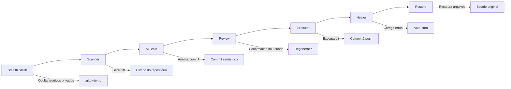

# GitPy: O Co-Piloto DevOps para Seus Repositórios ☁️🤖

> **"Ele não apenas versiona. Ele Entende, Protege, Automatiza e Cura."**

**GitPy** é uma CLI de última geração que transforma seu fluxo de trabalho Git. Construído na **Vibe Architecture** (um sistema modular de cartuchos plugáveis) e alimentado por IA (atualmente via **Groq**, **OpenAI**, **Gemini**, **Ollama**, **OpenRouter**), ele age como um engenheiro DevOps sênior trabalhando com você em tempo real.

---

## 🚀 Início Rápido

### Configuração Zero Requerida

```bash
# Instale dependências
pip install -r requirements.txt

# Configure seu provedor de IA (copie .env.example para .env)
cp .env.example .env
# Edite .env com suas chaves de API

# Execute modo autônomo
python launcher.py auto --yes
```

> **Um Comando para Tudo**: GitPy automaticamente escaneia, analisa, comita e envia suas mudanças com mensagens de commit semânticas.

---

## 🏗️ Visão Geral da Arquitetura

### A Vibe Architecture

GitPy usa um sistema modular de cartuchos onde cada funcionalidade é um componente isolado:

```
GitPy Core (vibe_core.py)
├── 🧠 Cartuchos de IA
│   ├── ai-brain      → Geração de mensagens de commit
│   ├── ai-groq       → Integração com API Groq
│   ├── ai-openai     → Integração com OpenAI GPT
│   ├── ai-gemini     → Integração com Google Gemini
│   ├── ai-ollama     → Integração com Ollama local
│   └── ai-openrouter → Integração com OpenRouter API
├── ⚙️ Cartuchos Core
│   ├── git-scanner   → Análise de repositório
│   ├── git-executor  → Operações Git
│   ├── git-healer    → Auto-resolução de conflitos
│   ├── git-branch    → Gerenciamento de branches
│   └── git-tag       → Operações de tags
├── 🛡️ Cartuchos de Segurança
│   ├── sec-sanitizer → Bloqueia arquivos sensíveis
│   ├── sec-redactor  → Mascara dados sensíveis
│   └── sec-keyring   → Armazenamento seguro de credenciais
└── 🔧 Cartuchos de Ferramentas
    ├── tool-stealth   → Oculta arquivos privados temporariamente
    └── tool-ignore    → Gerenciamento inteligente de .gitignore
```

### Fluxo de Automação



---

## 🌟 Matriz de Funcionalidades

| Categoria | Funcionalidade | Descrição | Comando |
| :--- | :--- | :--- | :--- |
| **� IA Core** | **Commits Semânticos** | Analisa diffs e escreve Conventional Commits | `auto` |
| | **Regeneração de Mensagens** | Regeneração interativa até satisfação | `auto` (interativo) |
| | **Suporte Multi-Provider** | Groq, OpenAI, Gemini, Ollama, OpenRouter | `--model <provider>` |
| | **Dicas de Contexto** | Guia IA com contexto específico | `-m "contexto"` |
| **� Automação** | **Modo Totalmente Autônomo** | Operação hands-free completa | `auto --yes` |
| | **Menu Interativo** | Menu guiado para todas operações | `menu` |
| | **Simulação Dry Run** | Prévia ações sem executar | `--dry-run` |
| | **Commits Locais Apenas** | Commit sem push | `--no-push` |
| | **Modo Skip Deploy** | Adiciona [CI Skip] para evitar builds | `--nobuild` |
| **🌿 Gerenciamento de Branch** | **Criação de Branch de Teste** | Cria/usando branches isolados | `--branch <nome>` |
| | **Navegação de Branch** | Alterna entre branches existentes | `--branch <existente>` |
| | **Central de Branches** | Operações completas de branch | `menu → Central de Branches` |
| **🏷️ Gerenciamento de Tags** | **Operações de Tags** | Criar, listar, deletar, resetar tags | `menu → Central de Tags` |
| | **Confirmação Forte** | Código de 4 caracteres para ops destrutivas | Interativo |
| **🛡️ Segurança** | **Stealth Mode** | Oculta temporariamente arquivos privados | `.gitpy-private` |
| | **Muralha de Chumbo** | Sistema de segurança de 3 camadas | Automático |
| | **Proteção Blocklist** | Impede commits de arquivos sensíveis | Automático |
| | **Redação de Dados** | Mascara senhas em diffs | Automático |
| | **Panic Lock .Env** | Proteção inquebrável de .env | Automático |
| **🧠 Recursos Inteligentes** | **Smart Ignore** | Sugestões proativas de .gitignore | Automático |
| | **Smart Whitelist** | Exceções customizadas em .gitignore | Comentários em .gitignore |
| | **Configuração Modular** | Padrões ignoráveis editáveis | `common_trash.json` |
| | **Vibe Vault** | Lida com diffs grandes (>100KB) | Automático |
| **🌍 Internacionalização** | **Interface Multi-Idioma** | CLI em Inglês/Português | `LANGUAGE=pt` |
| | **Commits Multi-Idioma** | Mensagens em Inglês/Português | `COMMIT_LANGUAGE=pt` |
| | **Configurações Independentes** | Idiomas diferentes para interface/commits | Config `.env` |
| **🛠️ Diagnósticos** | **Verificação de Saúde IA** | Testa chaves de API e conectividade | `check-ai` |
| | **Modo Deep Trace** | Captura payloads de IA para debug | `--debug` |
| | **Visualizador de Recursos** | Mapa completo de recursos do GitPy | `menu → Ver Recursos` |
| **🔧 Avançado** | **Git Healer** | Auto-correção de conflitos de push | Automático |
| | **Reset de Repositório** | Operações guiadas de reset de repo | `menu → Resetar Repositório` |
| | **Wrappers de Comando** | Integração global com sistema | `gitpy.cmd`, `pygit.cmd` |

---

## 🎮 Guia de Uso

### Comandos Principais

| Comando | Propósito | Exemplo |
| :--- | :--- | :--- |
| **`auto`** | Commit autônomo & push | `python launcher.py auto --yes` |
| **`menu`** | Interface guiada interativa | `python launcher.py menu` |
| **`check-ai`** | Testa conectividade do provedor IA | `python launcher.py check-ai` |

### Opções de Comando

| Flag | Atalho | Função | Exemplo |
| :--- | :--- | :--- | :--- |
| `--yes` | `-y` | **Confirmação Automática** - Aceita tudo sem perguntar | `auto --yes` |
| `--dry-run` | | **Simulação** - Prévia ações sem executar | `auto --dry-run` |
| `--no-push` | | **Commit Local Apenas** - Commit sem push | `auto --yes --no-push` |
| `--nobuild` | | **Skip Deploy** - Adiciona [CI Skip] para evitar builds CI/CD | `auto --yes --nobuild` |
| `--branch <nome>` | `-b` | **Branch de Teste** - Cria/usando branch específico | `auto --yes --branch feature-test` |
| `--message "..."` | `-m` | **Dica de Contexto** - Guia IA com contexto específico | `auto -m "fix login bug"` |
| `--model <nome>` | | **Escolher Provider** - Seleciona provedor IA manualmente | `auto --model openai` |
| `--debug` | | **Deep Trace** - Ativa diagnóstico avançado | `--debug auto` |
| `--path <dir>` | `-p` | **Diretório Alvo** - Executa em repositório diferente | `--path /caminho/para/repo auto` |

### Exemplos Práticos

#### Workflows Básicos
```bash
# Fluxo autônomo completo
python launcher.py auto --yes

# Modo interativo com regeneração
python launcher.py auto
# → Mostra mensagem de commit
# → Escolha: Executar / Regenerar / Cancelar

# Simulação para ver o que aconteceria
python launcher.py auto --dry-run
```

#### Gerenciamento de Branch
```bash
# Crie e trabalhe em branch de teste
python launcher.py auto --yes --branch feature-auth

# Altere para branch existente
python launcher.py auto --yes --branch develop

# Teste isolado sem deploy
python launcher.py auto --yes --branch experiment --nobuild --no-push
```

#### Cenários de Produção
```bash
# Commits em andamento (apenas local)
python launcher.py auto --yes --no-push

# Economize cota de build em CI/CD
python launcher.py auto --yes --nobuild

# Debug problemas de integração com IA
python launcher.py --debug auto --model groq

# Commit com contexto específico
python launcher.py auto --yes -m "refatorar sistema de autenticação"
```

---

## 🔧 Configuração

### Configuração do Ambiente

1. **Copie o template**:
```bash
cp .env.example .env
```

2. **Configure seus provedores**:
```env
# Provedor de IA (auto, openrouter, groq, openai, gemini, ollama)
AI_PROVIDER=auto

# Configurações de Idioma (Independentes)
LANGUAGE=en                    # Idioma da interface (en, pt)
COMMIT_LANGUAGE=en           # Idioma das mensagens de commit (en, pt)

# Chaves de API (escolha pelo menos uma)
GROQ_API_KEY=sua_chave_groq_aqui
OPENROUTER_API_KEY=sua_chave_openrouter_aqui
OPENAI_API_KEY=sua_chave_openai_aqui
GEMINI_API_KEY=sua_chave_gemini_aqui
```

### Configuração de Idioma

| Configuração | Opções | Padrão | Descrição |
| :--- | :--- | :--- | :--- |
| `LANGUAGE` | `en`, `pt` | `en` | Idioma da interface (menus, mensagens) |
| `COMMIT_LANGUAGE` | `en`, `pt` | `en` | Idioma das mensagens de commit geradas por IA |

**Exemplo Bilíngue**:
```env
# Interface em português, commits em inglês
LANGUAGE=pt
COMMIT_LANGUAGE=en
```

### Configuração do Provedor de IA

| Provedor | Config Modelo | Chave Necessária | Obter Chave |
| :--- | :--- | :--- | :--- |
| **Groq** | `GROQ_MODEL=meta-llama/llama-4-scout-17b-16e-instruct` | `GROQ_API_KEY` | [console.groq.com](https://console.groq.com/keys) |
| **OpenAI** | `OPENAI_MODEL=gpt-4o-mini` | `OPENAI_API_KEY` | [platform.openai.com](https://platform.openai.com/api-keys) |
| **Gemini** | `GEMINI_MODEL=gemini-pro` | `GEMINI_API_KEY` | [aistudio.google.com](https://aistudio.google.com/app/apikey) |
| **OpenRouter** | `OPENROUTER_MODEL=meta-llama/llama-4-scout` | `OPENROUTER_API_KEY` | [openrouter.ai](https://openrouter.ai/keys) |
| **Ollama** | Modelos locais | Nenhuma | [ollama.ai](https://ollama.ai) |

---

## 🛡️ Recursos de Segurança

### Proteção Multi-Camadas

1. **Sistema Blocklist** - Impede leitura de arquivos sensíveis
2. **Redação de Dados** - Mascara senhas e tokens em diffs
3. **Stealth Mode** - Oculta temporariamente arquivos privados
4. **Panic Lock** - Proteção inquebrável de .env

### Stealth Mode (.gitpy-private)

Oculte arquivos sensíveis sem poluir seu `.gitignore` público:

```text
# .gitpy-private
.my_secret_folder/
local_logs.txt
agent_configs_x/*.json
```

**Como funciona**:
1. GitPy move arquivos para pasta temporária `.gitpy-temp`
2. Git executa "cego" sem ver estes arquivos
3. Arquivos são restaurados após as operações completarem
4. Recuperação automática se interrompido

### Smart Whitelist (.gitignore)

Controle o que é sugerido como "lixo" usando comentários especiais:

```gitignore
# ["build", "node_modules"] do not ignore
*.log
*.pyc
.DS_Store

# ["coverage"] do not ignore
.env
```

### Bloqueio de Segurança .Env

**⚠️ PROTEÇÃO INQUEBÁVEL**: Tentar adicionar .env à whitelist aciona desligamento imediato:

```
⚠️ ALERTA DE SEGURANÇA: O arquivo .env foi marcado para NÃO ser ignorado.
Isso pode expor suas senhas no GitHub!
ERRO: Operação cancelada por segurança.
```

---

## 🌿 Recursos Avançados

### Regeneração de Mensagens

Regeneração interativa até ficar satisfeito:

```bash
python launcher.py auto
# → IA gera mensagem de commit
# → Escolha: Executar / Regenerar / Cancelar
# → Se "Regenerar": IA cria nova mensagem
# → Repita até ficar satisfeito
```

### Gerenciamento de Branch

**Operações completas de branch**:

```bash
# Central de branch interativa
python launcher.py menu
# → "Central de Branches"
# → Branch atual, listar branches, criar, alternar
```

**Operações de branch por linha de comando**:
```bash
# Crie nova branch de teste
python launcher.py auto --yes --branch feature-login

# Altere para branch existente
python launcher.py auto --yes --branch develop

# Validação de branch (padrões Git)
# - Deve começar com letra/número
# - Máximo 255 caracteres
# - Sem nomes reservados (HEAD, master, main)
```

### Gerenciamento de Tags

**Central de Tags Interativa**:
```bash
python launcher.py menu
# → "Central de Tags"
# → Listar/Criar/Deletar/Resetar tags
```

**Sistema de Confirmação Forte**:
- Operações destrutivas requerem código de 4 caracteres
- Formato: `LETRA-NÚMERO-LETRA-LETRA` (ex: `B2CR`)
- Validação case-insensitive
- Previne deleções acidentais

### Git Healer

**Resolução automática de conflitos**:
- Detecta falhas de push (conflitos, rejeições)
- Pede à IA instruções específicas para correção
- Aplica correções automaticamente
- Tenta push novamente até o sucesso

---

## 🌍 Internacionalização

### Suporte Multi-Idioma

**Idiomas da Interface**:
- Inglês (`en`) - Padrão
- Português (`pt`) - Tradução completa

**Idiomas de Commit**:
- Inglês (`en`) - Padrão
- Português (`pt`) - Suporte completo

### Configuração Independente

Interface e commits podem usar idiomas diferentes:

```env
# Interface em português, commits em inglês
LANGUAGE=pt
COMMIT_LANGUAGE=en

# Interface em inglês, commits em português  
LANGUAGE=en
COMMIT_LANGUAGE=pt
```

### Fallback Seguro

- Traduções ausentes automaticamente usam Inglês como fallback
- Templates de commit usam Inglês se não encontrados
- Sem mudanças quebrantes ao adicionar novos idiomas

### Adicionando Novos Idiomas

Para adicionar suporte para novo idioma (ex: Espanhol):
1. Crie `locales/es.json` para traduções da interface
2. Crie `cartridges/ai/ai-brain/prompts/es.json` para templates de commit
3. Configure `LANGUAGE=es` e/ou `COMMIT_LANGUAGE=es` em `.env`

---

## 🛠️ Diagnósticos & Debugging

### Verificação de Saúde da IA

Teste sua configuração de IA:

```bash
python launcher.py check-ai
```

**Verificações realizadas**:
- Validação de chaves de API
- Conectividade do provedor
- Disponibilidade do modelo
- Validação do formato de resposta

### Modo Deep Trace

Ative debugging avançado:

```bash
python launcher.py --debug auto
```

**Captura em `.vibe-debug.log`**:
- Payloads exatos enviados para IA
- Respostas brutas da IA incluindo erros
- Códigos de erro técnicos
- Ciclo completo de requisição/resposta

**Casos de uso**:
- Debug erros de cota excedida
- Identificar problemas de disponibilidade de modelo
- Auditar dados enviados para LLMs
- Monitorar integração durante desenvolvimento

### Visualizador de Recursos

```bash
python launcher.py menu
# → "Ver Recursos"
```

Mostra mapa completo de recursos do GitPy:
- Fluxos e comandos CLI
- Wrappers disponíveis
- Opções globais
- Status i18n

---

## 📦 Sistema Vibe Vault

### Lidando com Diffs Grandes

**Gerenciamento automático de payloads grandes**:
- Diffs > 100KB armazenados automaticamente na memória
- IDs de referência passados em vez de dados brutos
- Previne problemas de serialização JSON
- Mantém performance com mudanças grandes

### Gerenciamento de Memória

```python
# Nos bastidores (automático)
ref_id = VibeVault.store(large_diff)
# Passa ref_id para cartuchos de IA
result = VibeVault.retrieve(ref_id)
VibeVault.cleanup(ref_id)
```

---

## 🧰 Wrappers de Linha de Comando

### Integração com Windows

**gitpy.cmd**:
```batch
@echo off
python "%~dp0launcher.py" %*
```
- Execute GitPy de qualquer diretório
- Resolução automática de caminho
- Sem mudanças manuais de diretório necessárias

**pygit.cmd**:
```batch
@echo off
C:\code\GitHub\gitpy\.venv\Scripts\activate.bat
```
- Ativa ambiente virtual do projeto
- Dependências consistentes entre equipe
- Caminho fixo de ambiente virtual

### Adicionando ao Windows PATH

1. Pesquise "Editar variáveis de ambiente do sistema"
2. Em "Variáveis do sistema", selecione `Path` → "Editar"
3. Adicione diretório raiz do GitPy
4. Reinicie terminal

### Port para Linux/macOS

**gitpy.sh**:
```bash
#!/usr/bin/env bash
SCRIPT_DIR="$(cd "$(dirname "${BASH_SOURCE[0]}")" && pwd)"
python "$SCRIPT_DIR/launcher.py" "$@"
```

**pygit.sh**:
```bash
#!/usr/bin/env bash
SCRIPT_DIR="$(cd "$(dirname "${BASH_SOURCE[0]}")" && pwd)"
source "$SCRIPT_DIR/.venv/bin/activate"
```

---

## 🔧 Configuração Modular

### Padrões Comuns de Lixo

Edite `cartridges/tool/tool-ignore/common_trash.json`:

```json
[
    ".env",
    "__pycache__/",
    "*.pyc",
    "*.log",
    ".DS_Store",
    "node_modules/",
    "build/",
    ".vscode/",
    ".idea/",
    "coverage/",
    "*.swp",
    ".gitpy-private"
]
```

### Carregamento Dinâmico

- Padrões carregados dinamicamente em runtime
- Fallback seguro se JSON corrompido
- Padrão sempre inclui: `[".env", "node_modules/", "build/"]`
- Sem mudanças de código necessárias para customização

---

## 📋 Casos de Uso & Workflows

### Workflow de Desenvolvimento

```bash
# Configuração matinal - verificar status da IA
python launcher.py check-ai

# Trabalhe em branch de feature
python launcher.py auto --yes --branch feature-new-ui

# Múltiplos commits durante desenvolvimento
python launcher.py auto --yes --no-push

# Push final com deploy
python launcher.py auto --yes
```

### Colaboração em Equipe

```bash
# Interface em português, commits em inglês (equipe internacional)
LANGUAGE=pt
COMMIT_LANGUAGE=en

# Trabalhe em branch compartilhada
python launcher.py auto --yes --branch team-feature

# Pule deploy durante desenvolvimento ativo
python launcher.py auto --yes --nobuild
```

### Deploy de Produção

```bash
# Correção de bug crítica - pule CI/CD
python launcher.py auto --yes -m "fix: vulnerabilidade de segurança crítica" --nobuild

# Deploy manual após revisão
python launcher.py auto --yes
```

### Troubleshooting

```bash
# Debug problemas de conexão
python launcher.py --debug auto

# Verifique .vibe-debug.log para detalhes
cat .vibe-debug.log

# Verifique provedores de IA
python launcher.py check-ai
```

---

## 🏗️ Arquitetura Técnica

### Sistema de Cartuchos

Cada cartucho contém:
- `manifest.json` - Contrato de interface
- `main.py` - Lógica de negócio (máximo 250 linhas)
- `dlc.py` - Sidecar de infraestrutura
- `requirements.txt` - Dependências específicas

### Arquitetura do Kernel

**VibeKernel** (`vibe_core.py`):
- Execução híbrida async/sync
- Carregamento dinâmico de cartuchos
- Gerenciamento de memória (VibeVault)
- Rastreamento de ID de correlação
- Logging de deep trace

### Princípios de Engenharia

1. **Atomicidade** - Cartucho main.py ≤ 250 linhas
2. **Isolamento de Canais** - STDOUT para JSON, STDERR para logs
3. **Código Líquido** - Manifest é verdade, implementação é descartável
4. **Assincronicidade** - Nunca bloqueie o event loop

---

## 🚀 Checklist de Primeiros Passos

### ✅ Pré-requisitos
- [ ] Python 3.8+ instalado
- [ ] Git instalado e configurado
- [ ] Pelo menos uma chave de API de provedor de IA

### ✅ Instalação
- [ ] Clone repositório
- [ ] Instale dependências: `pip install -r requirements.txt`
- [ ] Copie `.env.example` para `.env`
- [ ] Configure chaves de API em `.env`

### ✅ Verificação
- [ ] Teste conectividade IA: `python launcher.py check-ai`
- [ ] Tente dry run: `python launcher.py auto --dry-run`
- [ ] Faça primeiro commit: `python launcher.py auto`

### ✅ Configuração Opcional
- [ ] Adicione GitPy ao PATH do sistema
- [ ] Configure wrappers de comando
- [ ] Defina idioma preferido em `.env`
- [ ] Crie `.gitpy-private` para arquivos sensíveis

---

## 🤝 Contribuindo

### Configuração de Desenvolvimento

```bash
# Clone e configure
git clone <repository-url>
cd gitpy
pip install -r requirements.txt

# Execute testes
python -m pytest tests/

# Verifique estilo de código
pylint *.py
```

### Adicionando Novos Cartuchos

1. Crie diretório: `cartridges/domain/module-name/`
2. Adicione `manifest.json` com contrato de interface
3. Implemente `main.py` (≤ 250 linhas)
4. Adicione `dlc.py` para infraestrutura se necessário
5. Adicione `requirements.txt` para dependências específicas
6. Teste com: `python launcher.py --debug auto`

### Padrões de Código

- Siga o Guia de Engenharia VIBE
- Mantenha isolamento de cartuchos
- Mantenha main.py sob 250 linhas
- Use async/await para operações de I/O
- Adicione tratamento de erros abrangente

---

## 📄 Licença

Este projeto está licenciado sob a Licença MIT - veja o arquivo LICENSE para detalhes.

---

## 🙏 Agradecimentos

- **Vibe Engineering** - Arquitetura modular de cartuchos
- **Provedores de IA** - Groq, OpenAI, Gemini, Ollama, OpenRouter
- **Comunidade Open Source** - Ferramentas e bibliotecas que tornam o GitPy possível

---

**GitPy: Code Mais Inteligente, Não Mais Difícil.** 💜

---

## 🧰 Wrappers de Linha de Comando GitPy

### gitpy.cmd
- Executa `python "%~dp0launcher.py" %*` usando o mesmo diretório do arquivo [`launcher.py`](file:///c:/code/GitHub/gitpy/launcher.py) para que GitPy possa ser invocado de qualquer pasta. O `%~dp0` expande para a pasta onde o `.cmd` reside, garantindo que todos os imports relativos e assets do projeto sejam resolvidos mesmo quando o comando é chamado fora da raiz.
- Como invoca diretamente o Python disponível no PATH do sistema, evita a necessidade de digitar o caminho completo para `launcher.py` ou mudar de diretórios antes de executar a automação.

### pygit.cmd
- Ativa o ambiente virtual do projeto chamando `C:\code\GitHub\gitpy\.venv\Scripts\activate.bat`, permitindo que comandos subsequentes (como `python launcher.py auto`) reusem as dependências fixas do projeto sem reconfigurar manualmente nada.
- Mantendo o caminho absoluto para `.venv`, o wrapper elimina a necessidade de localizar o ambiente virtual em cada máquina e facilita seu uso em qualquer terminal Windows.

### Por que estes wrappers existem e como adaptar os caminhos
Wrappers resolvem dois pontos principais de dor no Windows:
1. **Resolução de caminho relativo**: `%~dp0` garante que Python localize `launcher.py` e módulos associados mesmo quando você está em outra pasta.
2. **Virtualenv consistente**: `pygit.cmd` conecta você diretamente ao `.venv` localizado na raiz do repositório, garantindo o mesmo conjunto de dependências usado pela equipe.

Ambos usam caminhos absolutos (`C:\code\GitHub\gitpy\` e `C:\code\GitHub\gitpy\.venv\Scripts\activate.bat`) como exemplos apenas. Para adaptar os wrappers em outro ambiente:
- **Windows**: encontre o caminho real do repositório (explorer ou `cd`). Em `pygit.cmd`, substitua o prefixo com o diretório correto (`SEU_PATH\.venv\Scripts\activate.bat`). Mantenha `gitpy.cmd` com `%~dp0` para continuar resolvendo o launcher automaticamente. Ao mover a pasta, apenas atualize o PATH do sistema para incluir a nova raiz.
- **Linux/macOS**: crie scripts `gitpy.sh` e `pygit.sh` na raiz com `SCRIPT_DIR="$(cd "$(dirname "${BASH_SOURCE[0]}")" && pwd)"` e use `source "$SCRIPT_DIR/.venv/bin/activate"`. Adicione o diretório raiz ao PATH via `~/.profile`, `~/.bashrc`, ou equivalente.

### Adicionando a pasta GitPy ao Windows PATH
1. Abra o menu Iniciar e procure por "Editar as variáveis de ambiente do sistema".
2. Em "Variáveis do sistema", selecione `Path` e clique em "Editar".
3. Adicione um novo item com o caminho completo da pasta contendo `gitpy.cmd` e `pygit.cmd`.
4. Confirme e abra um novo terminal para carregar o PATH atualizado.
5. (Opcional) execute `refreshenv` ou reinicie o terminal.

### Verificação de Sucesso no Windows
- `where gitpy.cmd` deve retornar o caminho completo do script.
- `gitpy auto --dry-run` deve funcionar de qualquer pasta sem precisar de `cd`.
- `pygit` deve mostrar o prefixo `(.venv)` e permitir `pygit python launcher.py --help`.

### Portando lógica para Linux: gitpy.sh e pygit.sh
- **Estrutura**:
  ```bash
  #!/usr/bin/env bash
  SCRIPT_DIR="$(cd "$(dirname "${BASH_SOURCE[0]}")" && pwd)"
  python "$SCRIPT_DIR/launcher.py" "$@"
  ```
- **Ativando virtualenv**:
  ```bash
  #!/usr/bin/env bash
  SCRIPT_DIR="$(cd "$(dirname "${BASH_SOURCE[0]}")" && pwd)"
  source "$SCRIPT_DIR/.venv/bin/activate"
  ```
- **Diferenças e permissões**:
  1. `.cmd` depende de comandos Windows (`@echo off`, `%~dp0`); `.sh` requer shebang, `$(...)` e `"$@"` para argumentos.
  2. `.sh` precisa de `chmod +x gitpy.sh pygit.sh`; `.cmd` funciona sem permissão extra.
  3. Use `/usr/local/bin` ou `~/.local/bin` para versões globais ou crie `ln -s /path/to/gitpy.sh /usr/local/bin/gitpy`.

### Como verificar ativação do ambiente virtual
- **Windows (cmd/powershell)**:
  1. Execute `C:\seu\path\gitpy\pygit.cmd` e confirme o prefixo `(.venv)`.
  2. `where python` deve apontar para `.venv\Scripts\python.exe`.
  3. `python -c "import os; print(os.environ.get('VIRTUAL_ENV'))"` deve imprimir o caminho do virtualenv.
- **Linux/macOS**:
  1. `source /seu/path/gitpy/.venv/bin/activate` deve mostrar o prefixo `(.venv)`.
  2. `which python` deve apontar para `.venv/bin/python`.
  3. `echo $VIRTUAL_ENV` e `python -c "import sys; print(sys.prefix)"` devem corresponder ao `.venv`.

### Substituindo exemplos nos wrappers
- No Windows, atualize `pygit.cmd` para `D:\workspace\gitpy\.venv\Scripts\activate.bat` ou use `%~dp0` para caminhos relativos.
- No Linux, confirme `pwd` e ajuste `source "$SCRIPT_DIR/.venv/bin/activate"` para apontar para o `.venv` correto.

### Exemplos de uso após configuração
- **Windows**:
  ```powershell
  cd C:\Users\alice\projects\other-repo
  gitpy auto --yes --no-push
  pygit python launcher.py --dry-run
  ```
- **Linux** (assumindo `/usr/local/bin` no PATH):
  ```bash
  cd ~/other-project
  gitpy auto --yes --nobuild
  pygit python launcher.py --help
  ```
Estes comandos funcionam de qualquer diretório porque o PATH resolve os wrappers globalmente e cada script descobre a raiz do GitPy internamente.

### Observações finais
Mantenha os wrappers na raiz do projeto e use os comandos descritos acima como modelos. Atualize os caminhos sempre que mover o repositório ou recriar o `.venv`, garantindo consistência para toda a equipe.
